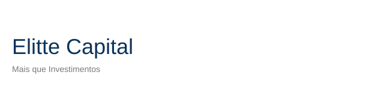
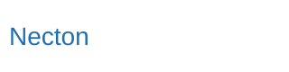

  
   
  
    
    
    
  

# Elitte Capital — Workspace + NotebookLM Hub (Kit do Cliente) ✨

> **"Mais que Investimentos, Um Relacionamento Estratégico com Seu Futuro."**
> Com a curadoria inspirada no modelo de Family Office, oferecemos soluções financeiras personalizadas para proteger, perpetuar e dar sentido ao seu patrimônio.

**Agora, com suporte da FoundLab e infraestrutura segura na Google Cloud, a Elitte Capital conta com tecnologia, governança e nuvem de alta disponibilidade para transformar conhecimento em decisões.**

  
  
  

---

(Conteúdo idêntico ao `README.md`, em PT-BR. Consulte `README_en.md` para versão em inglês.)
