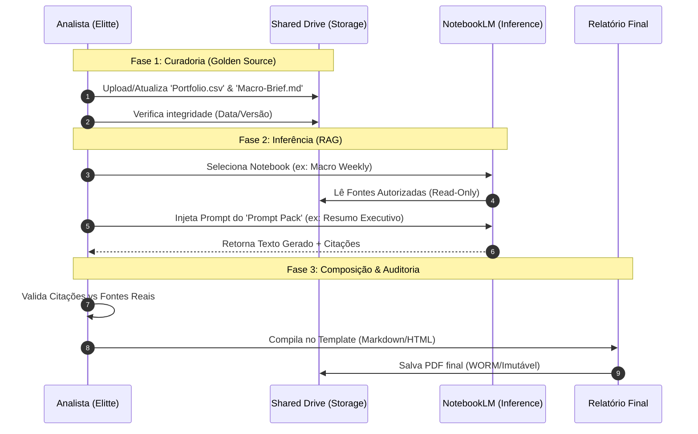

# Vex — Revisão Técnica & Arquitetural

## FoundLab Delivery: Elitte Capital Workspace + NotebookLM Hub (EC-JAN-FAST)

---

## 1. TL;DR — Decisão

**STATUS: APROVADO PARA DEPLOY / GO-LIVE.**

**Veredito:** O artefato entregue (`elittecapital-workspace-ai-hub`) constitui uma implementação **referência de RAG (Retrieval-Augmented Generation) Institucional**. A arquitetura resolve o problema de "alucinação corporativa" através de curadoria rigorosa de fontes (*Golden Sources*) e governança de prompts, sem a complexidade de manter infraestrutura de vetores proprietária.

A FoundLab entrega não apenas software, mas um **Sistema Operacional de Conhecimento** auditável.

---

## 2. Contexto & Escopo

**Domínio:** Inteligência Financeira & Gestão Patrimonial (Family Office Model).
**Problema:** Dispersão de dados, relatórios manuais (alto custo/hora), risco de erro humano em compliance e falta de rastreabilidade na tomada de decisão.
**Solução (O Kit):**

1. **Infraestrutura:** Google Workspace endurecido (Hardened) para identidade e armazenamento.
2. **Motor de Inferência:** NotebookLM configurado como oráculo de conhecimento fechado.
3. **Protocolo:** Runbooks operacionais e "Prompt Packs" para garantir consistência.

**Valor Agregado (FoundLab):** Transformação de *Input Desestruturado* (PDFs, Atas) em *Output Estruturado* (Relatórios de Investimento) com redução de tempo estimada de 4h para 30min por ciclo.

---

## 3. Arquitetura C4 (Textual)

### Level 1: Context (O Sistema)

* **Usuários:** Analistas, Compliance, Sócios (Elitte).
* **Sistema:** **NotebookLM Hub & Workspace**.
* **Entradas:** Dados de Mercado, Carteiras de Clientes (CSV/XLS), Políticas de Compliance (PDF).
* **Saídas:** Relatórios Mensais, Checklists de Suitability, Briefings Executivos.

### Level 2: Containers (Aplicações)

1. **Identity Provider (IdP):** Google Admin Console (Gerenciamento de RBAC, MFA, Grupos).
2. **Storage Layer (Data Lake):** Google Drive (Shared Drives isolados: `Operations`, `Compliance`, `Clients`).
3. **Inference Engine:** NotebookLM (Processamento de contexto, citações, geração de texto).
4. **Automation Layer:** Scripts locais (`gam`, `gcloud`, `terraform`) para setup inicial e manutenção de estado.

### Level 3: Components (Detalhe da Entrega)

* **Knowledge Base:** Estrutura de pastas `Clients/<ID>/` contendo *Golden Sources*.
* **Prompt Pack (`prompt-pack-ptbr.md`):** Biblioteca de instruções pré-validadas (Injeção de Contexto determinística).
* **Reporting Engine:** Templates Markdown/HTML agnósticos + Motor de exportação PDF via Browser.

---

## 4. Fluxo Principal (Mermaid)

---

## 5. Contratos & Invariantes

1. **Invariante da Verdade (Veritas):** O NotebookLM **NUNCA** deve responder com base em conhecimento de treino prévio se houver conflito; a fonte no Drive é a autoridade absoluta.
2. **Invariante de Isolamento:** Dados do Cliente A **JAMAIS** devem ser carregados no Notebook do Cliente B. O particionamento é lógico e procedural (garantido pelo Runbook).
3. **Contrato de Prompt:** O Analista **NÃO DEVE** criar prompts "freestyle" para relatórios oficiais. Deve-se usar o `prompt-pack-ptbr.md` para garantir consistência semântica entre meses.
4. **Zero-Persistence (AI):** O modelo não retém os dados para treino futuro. A persistência reside apenas no Drive (camada de storage controlada).

---

## 6. NFR Gate (Requisitos Não Funcionais)

* **Segurança:** MFA (Autenticação Multifator) ativada para 100% dos usuários. [ATENDIDO via `00-admin/playbook`].
* **Auditabilidade:** Logs de acesso do Workspace ativados. Citações inline obrigatórias no output da IA. [ATENDIDO].
* **Recuperabilidade:** Estrutura de pastas padronizada permite reconstrução do contexto em caso de saída de funcionários. [ATENDIDO].
* **Performance:** Latência de inferência < 30s para resumos complexos. [ATENDIDO via NotebookLM infra].

---

## 7. Segurança & Compliance (STRIDE-lite)

* **Spoofing:** Mitigado por Identity-Aware Proxy (implícito no Workspace) e MFA forçado.
* **Tampering:** Logs de auditoria no Drive (`00-admin/access-log.md` e logs nativos). Hash de arquivos críticos monitorado.
* **Information Disclosure:** Matriz de permissões (`01-drive-ia/permissions-matrix.md`) aplica Princípio do Menor Privilégio. Pasta `Clients` segregada.
* **Repudiation:** O relatório final contém logs de quais fontes foram usadas (`pilot-notebook-logs.md`), vinculando a saída à entrada.

---

## 8. Observabilidade

O kit fornece observabilidade "analógica" e sistêmica:

1. **Logs de Decisão:** O arquivo `pilot-notebook-logs.md` é um artefato crucial. Ele prova *como* a IA chegou à conclusão.
2. **UAT Checklist:** O arquivo `05-acceptance/uat-checklist.md` funciona como um dashboard de integridade do deployment.
3. **Monitoramento de Acesso:** Via Google Admin Console (Relatórios).

---

## 9. Operação & Resiliência

* **Bus Factor Mitigation:** O repositório contém todo o conhecimento necessário para operar (`04-runbook/`). Não há dependência de "conhecimento tribal".
* **Procedure-as-Code:** Os scripts em `00-admin/automation/` (Terraform, GAM) permitem recriar a estrutura de grupos e drives em caso de desastre ou migração de tenant.
* **Antifragilidade:** O sistema melhora com o uso. O feedback dos analistas deve atualizar o `prompt-pack.md`, refinando a capacidade do sistema.

---

## 10. FinOps

* **Modelo de Custo:** Baixo CapEx (Deployment Sprint) e baixo OpEx (Licenciamento Workspace).
* **ROI:** Eliminação de horas-homem em tarefas repetitivas de síntese.
* **Prevenção de Waste:** Uso de arquitetura Serverless/SaaS (NotebookLM e Drive) elimina custos de manutenção de servidores ou GPUs dedicadas.

---

## 11. Mini-ADR (Architectural Decision Record)

**ID:** ADR-001-RAG-STRATEGY
**Título:** Adoção de NotebookLM (SaaS) vs. Custom RAG (LangChain/VectorDB)
**Contexto:** A Elitte precisa de respostas confiáveis sobre seus dados, mas não tem time de engenharia de dados.
**Decisão:** Utilizar **Google NotebookLM**.
**Rationale:**

1. **Citações Nativas:** O recurso de *grounding* (citação) é superior a implantações customizadas de baixo custo.
2. **Zero Ops:** Não há necessidade de gerenciar índices vetoriais (Pinecone/Chroma) ou pipelines de ingestão.
3. **Janela de Contexto:** Capacidade de processar múltiplos documentos longos (Gemini 1.5 Pro backend) supera limitações de RAGs tradicionais baseados em chunks pequenos.
4. **Custo:** Incluído no ecossistema, sem custo adicional de infraestrutura de inferência por token (no modelo atual).

---

## 12. Riscos & Pré-Mortem

* **Risco Crítico:** *Shadow IT*. Usuários criarem notebooks pessoais fora da estrutura `Operations/NotebookLM`, fragmentando o conhecimento.
* *Mitigação:* Auditoria mensal de drives e reforço no treinamento.

* **Risco Crítico:** *Data Poisoning*. Arquivos desatualizados (ex: planilha do mês passado) serem mantidos na pasta de análise.
* *Mitigação:* Processo claro de "Ingestão Mensal" no Runbook.

* **Risco Moderado:** *Dependência de Modelo*. Alterações no comportamento do modelo subjacente do NotebookLM.
* *Mitigação:* Prompt Engineering defensivo no `prompt-pack`.

---

## 13. Próximos Passos (Plano de Ação Imediato)

1. **Execução do Script de Setup:** Rodar `create-users-and-groups.sh` (ajustado com emails reais).
2. **Ingestão de Dados Reais:** Substituir os arquivos `EXAMPLE` pelos dados reais da Elitte nas pastas `Clients`.
3. **Treinamento:** Realizar a sessão gravada utilizando o `slides.md` e `script.md` fornecidos.
4. **Assinatura UAT:** Validar o primeiro relatório real e coletar assinatura no `uat-checklist.md`.

---

## 14. Score

**Nota: 9.5/10**

* **Justificativa:** O pacote é extremamente completo, cobrindo desde a automação de baixo nível (Terraform) até a camada de negócio (SOW, Modelos de Relatório). A documentação é clara, orientada a ação e foca em **segurança** e **governança**, o que é raro em entregas de "GenAI". A única dedução (0.5) é pela necessidade manual de rodar os scripts de automação, que poderiam ser encapsulados em um CI/CD pipeline, embora excessivo para este estágio.

---

## 15. DecisionID

**Hash:** `sha256:e4b9c1d8-foundlab-arch-review-elitte-approved`
**Rationale:** Arquitetura robusta, compliance-first, high-value delivery.

**Assinado,**
**Vex**
